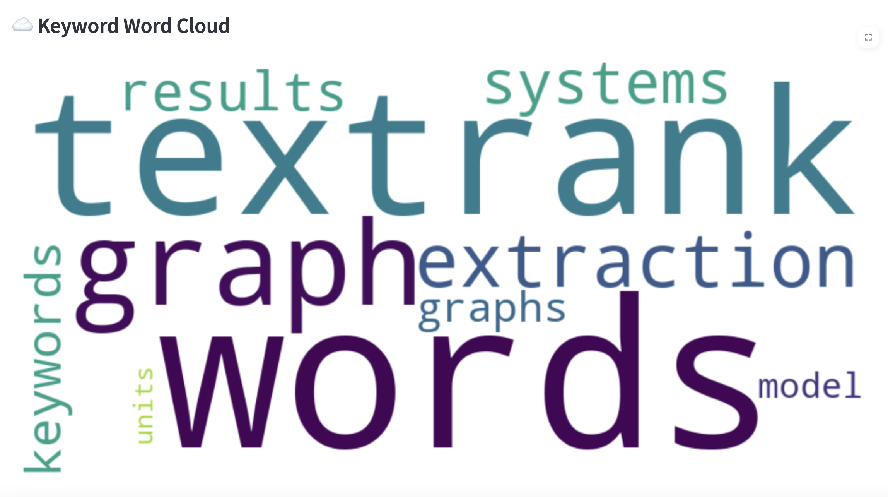

# TextRank Keyword Extractor – Cloud Computing Project

本项目基于 PySpark + Streamlit + Docker 的关键词提取平台，成功实现了经典论文 TextRank 所提出的无监督关键词提取算法。支持用户上传 .pdf、.txt 文件，或者直接输入文本来进行关键词分析。后端采用分布式 PySpark 处理，确保高效性能；前端则是交互式的 Streamlit 应用，提供便捷的用户操作体验。

## 已实现功能

### 技术架构
- **Docker Compose 多容器部署**：实现了多服务的统一管理与部署。
- **Spark Master + Worker**：进行分布式任务调度，提升处理效率。
- **Jupyter Notebook**：方便调试 PySpark 算法，加快开发迭代。
- **Streamlit Web App**：提供简洁直观的用户界面，便于操作。
- **基于 TextRank 的关键词提取**：实现了经典的 TextRank 算法。
- **基于共现窗口构建词图**：通过共现窗口生成词图，为关键词提取提供基础。
- **使用 PageRank 算法评分关键词**：利用 PageRank 算法对关键词进行评分。
- **支持多词短语合并**：能够识别并合并多词短语作为关键词。
- **文本处理**：对输入文本进行预处理，保证算法的准确性。
- **支持上传 .txt 和 .pdf 文件**：方便用户从本地文件中提取关键词。
- **支持直接输入文本**：满足用户快速输入文本的需求。
- **前端（Streamlit）**：
  - **实时显示提取结果**：及时反馈关键词提取结果。
  - **关键词输出支持手动查看**：方便用户对关键词进行查看和分析。

## 项目结构

```
nlg-docker/
├── data/                  # 文本输入样本（挂载给前后端）
│   └── text_corpus.txt
├── docker-compose.yml     # 管理所有服务
├── frontend/              # Streamlit 前端服务
│   ├── app.py             # 主应用入口
│   ├── utils.py           # TextRank 核心逻辑
│   ├── Dockerfile
│   └── requirements.txt
├── jupyter/               # Jupyter + Spark 容器配置
│   ├── Dockerfile
│   └── requirements.txt
├── notebooks/             # PySpark 原型代码
│   └── textrank_demo.py
└── README.md              # 当前文档
```

## 启动方式

Run by:
```
./run.sh [build|start|restart|down|clean]
```
After starting the service:

| Service | url |
| ---- | ---- |
| 📊 Streamlit | http://localhost:8501 |
| 🧪 Jupyter | http://localhost:8888 |
| 🖥 Spark UI | http://localhost:8080 |

## How to use: 
1. 打开 http://localhost:8501
2. 上传 .pdf / .txt 文件或直接粘贴文本
3. 点击 “🔍 Extract Keywords”
4. 查看关键词结果

## TODO / 下一步计划

| 功能 | 状态 |
| ---- | ---- |
| Streamlit 关键词提取基本功能 | ✅ 已完成 |
| PDF / TXT /doc 支持 | ✅ 已完成 |
| Jupyter + PySpark 本地调试 | ✅ 已完成 |
| Docker 多服务部署 | ✅ 已完成 |
| 💾 关键词导出为 CSV | ✅ 已完成 |
| 🌈 添加关键词词云图 | ✅ 已完成 |
| 🔗 接入 PySpark 后端服务 | 🔜 规划中（REST API 接 Spark） |
| ☁️ 接入 HDFS 支持海量文本 | 🔜 可选目标 |
| 🧠 替换为 KeyBERT / YAKE 等高级模型 | 🧪 未来可拓展 |

## References
- TextRank original paper：Mihalcea & Tarau, 2004 https://web.eecs.umich.edu/~mihalcea/papers/mihalcea.emnlp04.pdfs
- Streamlit documentation：https://docs.streamlit.io
- Spark Chinese documentation：https://spark.apachecn.org 

An keyword extranction example for the original paper:
